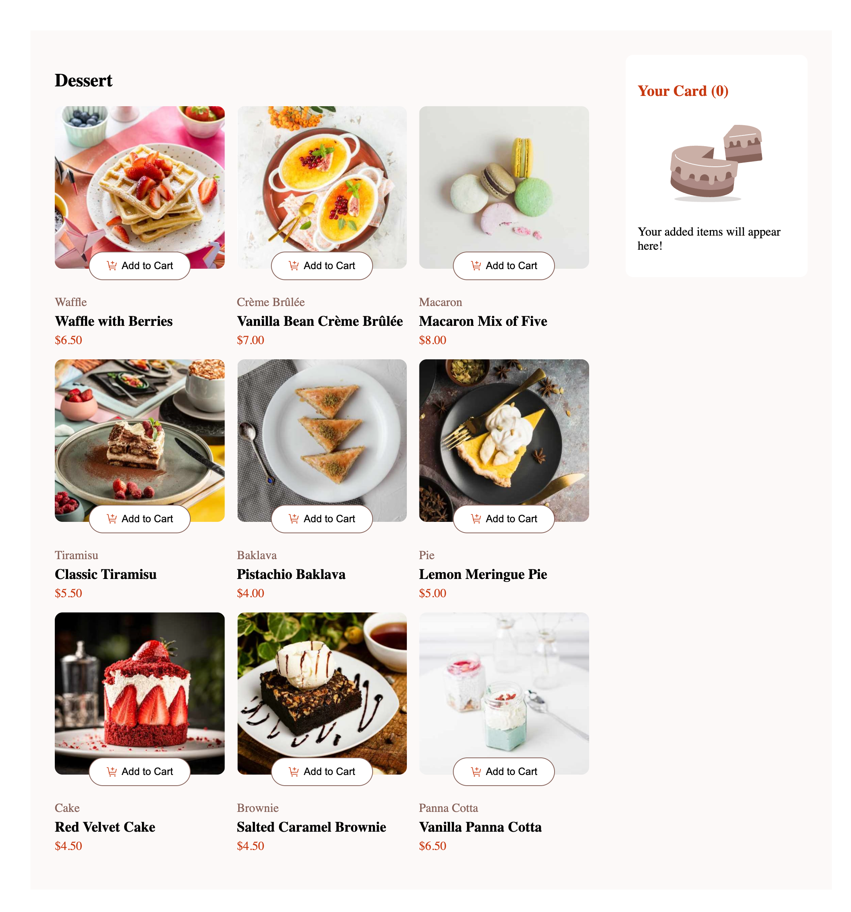

# Frontend Mentor - Product list with cart solution

This is a solution to the [Product list with cart challenge on Frontend Mentor](https://www.frontendmentor.io/challenges/product-list-with-cart-5MmqLVAp_d). Frontend Mentor challenges help you improve your coding skills by building realistic projects. 

## Table of contents

- [Overview](#overview)
  - [The challenge](#the-challenge)
  - [Screenshot](#screenshot)
  - [Links](#links)
  - [My process](#my-process)
  - [Built with](#built-with)
  - [What I learned](#what-i-learned)
  - [Useful resources](#useful-resources)
- [Author](#author)

## Overview

### The challenge

Users should be able to:

- Add items to the cart and remove them
- Increase/decrease the number of items in the cart
- See an order confirmation modal when they click "Confirm Order"
- Reset their selections when they click "Start New Order"
- View the optimal layout for the interface depending on their device's screen size
- See hover and focus states for all interactive elements on the page

### Screenshot

### Links

- Solution URL: [Add solution URL here](https://github.com/MSaadat1/product-list-with-cart-main)
- Live Site URL: [Add live site URL here](https://your-live-site-url.com)

## My process

### Built with

- CSS custom properties
- CSS Flexbox
- CSS Grid
- Mobile-first workflow
- JSON
- [React](https://reactjs.org/) - JS library
- [TypeScript](https://typescript.org/) - React framework
- [Styled Components](https://styled-components.com/) - For styles

### What I learned

I learned how to store data in JSON and pass it through the application and its components.
I learned how to manage a single state to support different styles and functionalities.
I learned how to centralize state and handler functions in the App component and pass them to child components via props.

## Author

- Website - [Mezhgan Saadat](https://dev-portfoliodollar.pantheonsite.io/)
- Frontend Mentor - [@Msaadat1](https://www.frontendmentor.io/profile/Msaadat1)
- Linkedin - [Mezhgan Saadat](www.linkedin.com/in/msaadat1)

